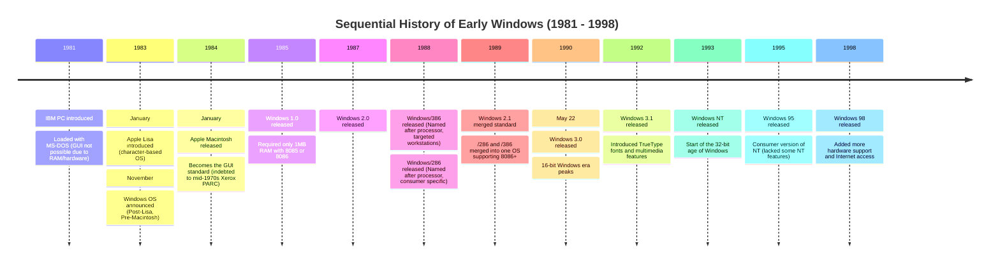

---
tags:
  - "#history/windows"
  - "#history/windows/timeline"
---

- Programs written for Windows whether it be Windows NT 4.0 or 5.0 or XP or Vista all are written in C or C++ language using Win32 API or [[Alternate options to Win32|modern alternatives]]
- Windows 98 and Windows NT (Industrial Windows) both were GUI based systems.
- Windows NT supported RISC architecture
- To learn about Win32 we need to know about the Windows from User perspective, have some knowledge about C language and a 32 bit C compiler, because after 1998 32 bit was the primary one.

## History of Windows

1. In fall of 1981 IBM PC was introduced which was loaded with MS DOS although at that time GUI was not possible due to RAM and other hardware constraints.
2. Apple also introduced its (ill fated) Lisa a GUI operating system in January 1983 which was also a character based OS.
3. In January 1984 it released Macintosh it is still considered the standard against which other graphical en vironments are measured (which I personally don't like).
4. All GUI are indebeted to the work done in Xerox Palo Alto Research Center (PARC) beginning in the mid-1970s. [[Windows NT and Windows 98#GUI|More information here]]
5. Windows announced its first OS in 1983 November (Post Lisa - Pre Macintosh), which was then released in 1985 (Microsoft 1.0), then Windows 2.0 in 1987, for these window versions, windows required only 1MB ram with 8088 or 8086.
6. Then Windows/386 was released, in name of processor it required (386 based processor targeting workstation based machines) and Windows /286 (which was also named after processor and was consumer specific) were both pre-cursor to windows 2.1. Later Windows /286 and Windows /386 was merged into one windows called Windows 2.1 as the market standard. supporting use of 8086 rather than 80286 and 80386.
7. Windows 3.0 was then released in 22 May 1990 which was 16 bit windows
8. Then came Windows 3.1 in 1992 with features like TrueType font, multimedia.
9. Then started 32 bit age of windows from 1993 with Windows NT, Windows 95 in 1995. Windows 95 was consumer version of Windows NT and didn't have all features of NT
10. In 1998 windows 98 was released with more hardware support and Internet access.

![[Windows Timeline.canvas]]
